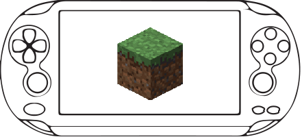
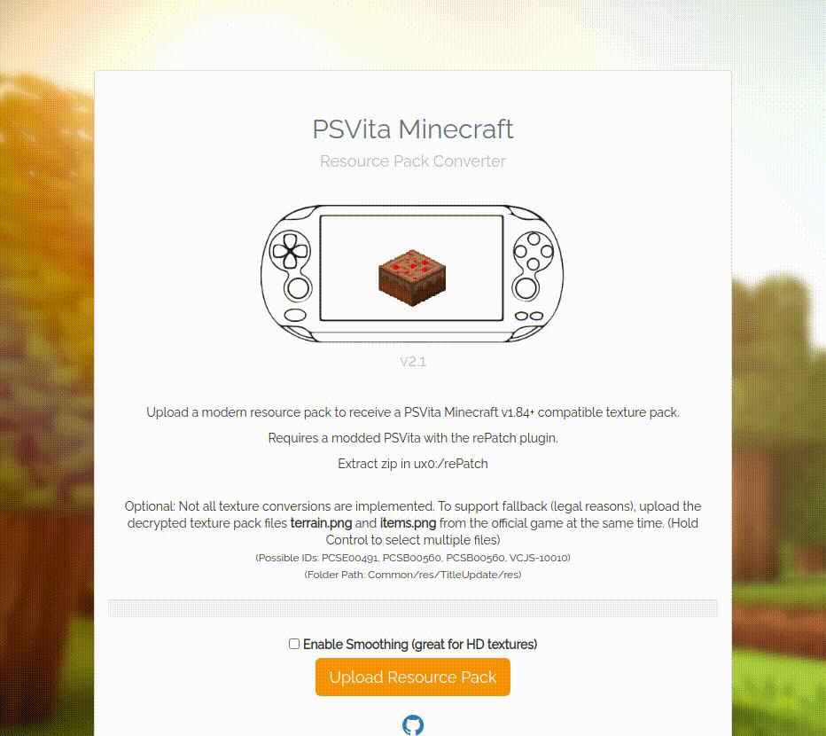

I havent maintained this project in over 5 years. However, due to some interest decided to update the repo with a readme file and quickly test to see if things still work. So bear with me.

# Requirements
- Imagemagick installed on your command line
- node.js installed (v23.11.0 seems to work)

# How to run
- `npm start`
- Navigate to localhost:3000
- Select the texture pack you want to convert
NOTE: due to copyright, there is no base texture pack in this repo. You will have to dump it yourself. You almost always want this. Without it, you will get all fallback blocks to be a basic simple color. Hold down shift when selecting these dumped textures. See the GIF animation included in this repo for more details.

# Instructions as seen on the home screen
Upload a modern resource pack to receive a PSVita Minecraft v1.84+ compatible texture pack.

Requires a modded PSVita with the rePatch plugin.

Extract zip in ux0:/rePatch

Optional: Not all texture conversions are implemented. To support fallback (legal reasons), upload the decrypted texture pack files terrain.png and items.png from the official game at the same time. (Hold Control to select multiple files). GIF example
(Possible IDs: PCSE00491, PCSB00560, PCSB00560, VCJS-10010)
(Folder Path: Common/res/TitleUpdate/res) 

